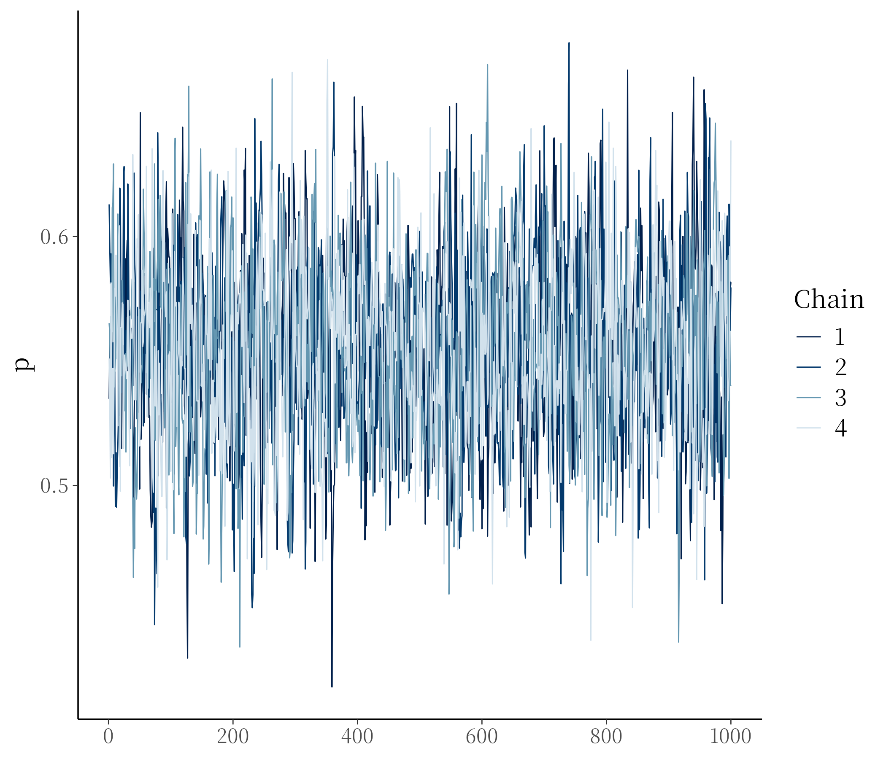
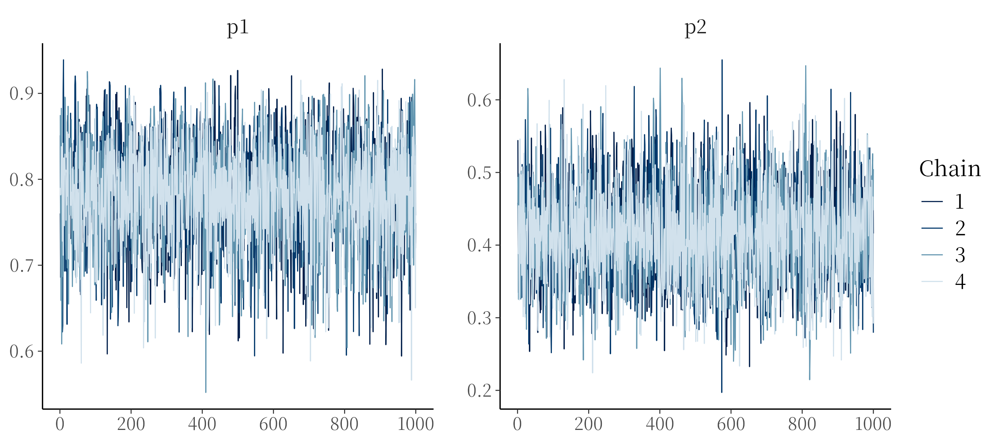

# Problem 1

First, we defined the following `STAN` model

```stan
data {
  int<lower=0> N;
  array[N] int<lower=0, upper=1> birth_1;
  array[N] int<lower=0, upper=1> birth_2;
}
parameters {
  real<lower=0, upper=1> p;
}
model {
  p ~ beta(1,1);
  birth_1 ~ bernoulli(p);
  birth_2 ~ bernoulli(p)
}
```

both `birth_1` and `birth_2` are arrays that contain probabilities for each 
family of having a male for each birth. Here, we assume that each birth is 
independent, and especially that the second one is independent of the first 
one. As for the prior, we used the beta distribution with parameter 1 and 1.
This gives a unfiorm prior bounded between 0 and 1. We could also have specified
a prior from a uniform distribution with lower bound 0 and upper bound 1, which 
would have act the same way. However, the beta distribution is the conjugate 
prior for the bernoulli distribution. This has nice mathematical and statistical 
properties.

Now we load the data and the relevant libraries

```{r}
library(rstan)
library(bayesplot)

load("birthdata.Rda")

dat <- birth.data

model.list <- list(
  N = nrow(dat),
  birth_1 = dat$birth1,
  birth_2 = dat$birth2
)
```

To ease the compilation of the document, the following code is simply a 
placeholder, and the output was manually pasted to avoid to run the stan 
model everytime we compile this file

```r
fit <- stan(file = "assignment_2/model.stan", data = model.list)

print(fit)
```
```
Inference for Stan model: anon_model.
4 chains, each with iter=2000; warmup=1000; thin=1; 
post-warmup draws per chain=1000, total post-warmup draws=4000.

        mean se_mean   sd    2.5%     25%     50%     75%   97.5% n_eff Rhat
p       0.56    0.00 0.04    0.49    0.53    0.56    0.58    0.63  1556    1
lp__ -139.34    0.02 0.75 -141.47 -139.51 -139.06 -138.87 -138.82  1865    1

Samples were drawn using NUTS(diag_e) at Tue Jun 23 12:54:04 2026.
For each parameter, n_eff is a crude measure of effective sample size,
and Rhat is the potential scale reduction factor on split chains (at 
convergence, Rhat=1).
```

The above output shows the information about the posterior distribution of 
$p$, which is the probability of a birth being a boy. Both the `Rhat` and the 
`n_eff` infromation are credible, indicating that the sampler worked properly.
For additional information, we included the trace plot of the four chains in 
@sec-trace-1 as additional information about the sampler.



# Problem 2

We adjusted the stan to the following specification

```stan
data {
  int<lower=0> N;
  array[N] int<lower=0, upper=1> birth_1;
  array[N] int<lower=0, upper=1> birth_2;
}
parameters {
  real<lower=0, upper=1> p1;
  real<lower=0, upper=1> p2;
}
model {
  p1 ~ beta(1, 1);
  p2 ~ beta(1, 1);
  for (i in 1 : N) {
    if (birth_1[i] == 0) {
      birth_2[i] ~ bernoulli(p1);
    } else if (birth_1[i] == 1) {
      birth_2[i] ~ bernoulli(p2);
    }
  }
  ;
}
```

We kept the same prior as before, and applied it to both $p_1$ and $p_2$.
As we are now interested in the conditional probability we wrote a conditional
function so $p_1$ is estimated from the first birth being a female and the second
birth being a male; $p_2$ is this estimated from first birth being a male and the 
second being a male. The two probabilities here are still assumed to be independent.

As in the previous problem, the following code is a placeholder and the output has
been manually added to avoid running the sampler everytime we compiled the document

```r
model.list.2 <- list(
  N = nrow(dat),
  birth_1 = dat$birth1,
  birth_2 = dat$birth2
)

fit.2 <- stan(file = "assignment_2/model_2.stan", data = model.list.2)

print(fit.2)
```
```
Inference for Stan model: anon_model.
4 chains, each with iter=2000; warmup=1000; thin=1; 
post-warmup draws per chain=1000, total post-warmup draws=4000.

       mean se_mean   sd   2.5%    25%    50%    75%  97.5% n_eff Rhat
p1     0.78    0.00 0.06   0.66   0.75   0.79   0.83   0.89  3473    1
p2     0.42    0.00 0.07   0.29   0.37   0.41   0.46   0.55  3307    1
lp__ -63.61    0.02 1.02 -66.36 -64.00 -63.31 -62.86 -62.58  1942    1

Samples were drawn using NUTS(diag_e) at Tue Jun 23 13:35:32 2026.
For each parameter, n_eff is a crude measure of effective sample size,
and Rhat is the potential scale reduction factor on split chains (at 
convergence, Rhat=1).
```

Similary, the above output shows the information about the posterior
distribution of $p_1$ and $p_2$, which is the probability of a birth
being a boy. Both the `Rhat` and the `n_eff` infromation are credible,
indicating that the sampler worked properly.  For additional information,
we included the trace plot of the four chains in @sec-trace-2 as additional
information about the sampler.



# Problem 3




# Appendix {.appendix #sec-appendix}

## Problem 1: trace plot {#sec-trace-1}





## Problem 2: trace plot {#sec-trace-2}


