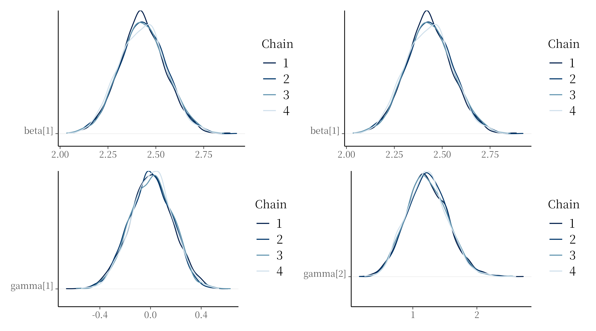
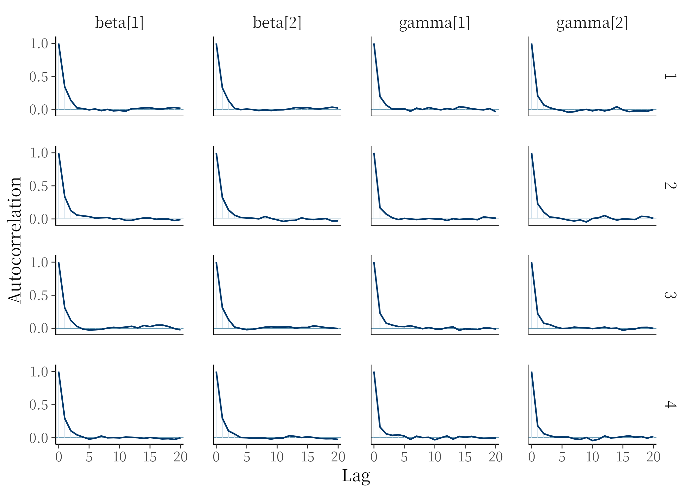
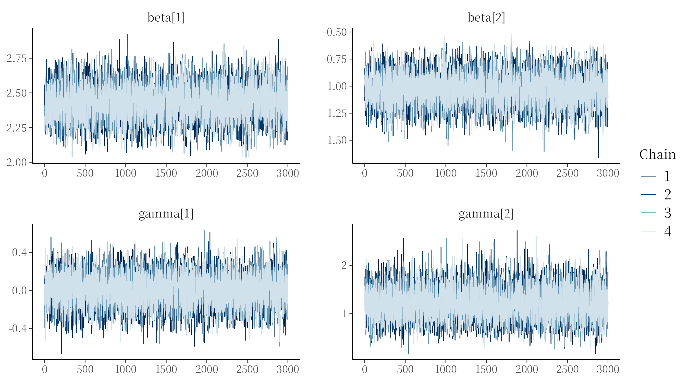
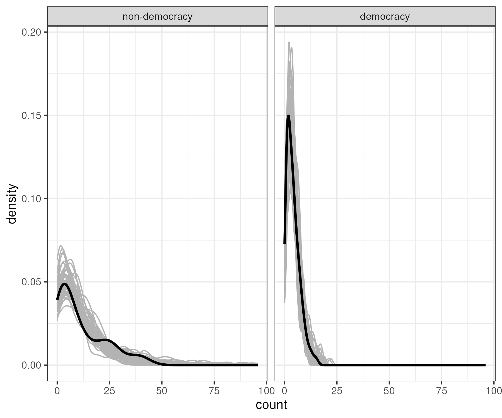

# Problem 1

To fit the model, I adaptated the `negbin.stan` from the class material to the following

```stan
data {
  // Define variables in data
  // Number of observations (an integer)
  int<lower=0> N;
  // Number of beta parameters
  int<lower=0> p;
  
  // Covariates
  vector<lower=0, upper=1>[N] bmr_dem;
  
  // Count outcome
  array[N] int<lower=0> wgov_leadexp;
}
parameters {
  // Define parameters to estimate
  vector[p] beta;
  vector[p] gamma;
}
transformed parameters {
  //
  vector[N] lp_mean;
  vector[N] lp_phi;
  vector<lower=0>[N] mu;
  vector<lower=0>[N] phi;
  
  // Mean
  lp_mean[1 : N] = beta[1] + beta[2] * bmr_dem[1 : N];
  mu[1 : N] = exp(lp_mean[1 : N]);
  
  // Overdispersion
  lp_phi[1 : N] = gamma[1] + gamma[2] * bmr_dem[1 : N];
  phi[1 : N] = exp(lp_phi[1 : N]);
}
model {
  // Prior part of Bayesian inference
  target += normal_lpdf(beta[1] | 0, 10);
  target += normal_lpdf(beta[2] | 0, 10);
  
  target += normal_lpdf(gamma[1] | 0, 3);
  target += normal_lpdf(gamma[2] | 0, 3);
  
  // Likelihood part of Bayesian inference
  target += neg_binomial_2_lpmf(wgov_leadexp[1 : N] | mu[1 : N], phi[1 : N]);
}
generated quantities {
  // array[N] real y_rep = poisson_rng(mu);
  vector[N] log_lik;
  for (n in 1 : N) 
    log_lik[n] = neg_binomial_2_lpmf(wgov_leadexp[n] | mu[n], phi[n]);
}
```

The main modification I made was to make `phi` function of the covariate, 
with different parameters that govern its value as those from the mean. For
this, phi is a linear combination of the covariate, an intercept (`gamma[1]`),
and a regression coefficient (`gamma[2]`). I then fitted the following sampler

```r
fit.negbin <- sampling(
  model.negbin,
  data = list(
    N = dim(tmp)[1],
    p = 2,
    bmr_dem = tmp$bmr_dem,
    wgov_leadexp = tmp$wgov_leadexp
  ), # data fed into the model
  seed = 654321, # RNG seed for replicability
  iter = 5000, # number of samples to draw per chain
  warmup = 2000, # number of discarded warmup samples/chain
  chains = 4,
  cores = 4, # number of independent samplers
  refresh = 1000 # how often to report sampler progress
)
```

### (a) posterior density

The following results are used to asses whether the sampler approximated
accurately the posterior density. First, let's start with the visual 
diagnostics. The @fig-density-chains present the density chains for the 
beta and gamma coefficients. All the density chains for each parameter 
look fairly similar. This is a first evidence that the sampler worked 
fine.

```r
beta_1_dens <- bayesplot::mcmc_dens_chains(fit.negbin, pars = "beta[1]")
beta_2_dens <- bayesplot::mcmc_dens_chains(fit.negbin, pars = "beta[2]")
gamma_1_dens <- bayesplot::mcmc_dens_chains(fit.negbin, pars = "gamma[1]")
gamma_2_dens <- bayesplot::mcmc_dens_chains(fit.negbin, pars = "gamma[2]")

(beta_1_dens + beta_1_dens) / (gamma_1_dens + gamma_2_dens)
```
{#fig-density-chains}

Now, we can look at the autocorrelation plots. The @fig-acp presents 
the autocorrelation for the same four paramters. The autocorrelation
drops fairly quickly as the lags increase, and remains quite stable 
at 0. 

```r
bayesplot::mcmc_acf(
  fit.negbin,
  pars = c("beta[1]", "beta[2]", "gamma[1]", "gamma[2]")
)
```
{#fig-acp}

Now, the trace plots. The @fig-trace-2 presents the trace plots for
the trace for each parameters. Similarly, the chains don't show any 
sign of stickiness.

```r
mcmc_trace(
  fit.negbin,
  pars = c("beta[1]", "beta[2]", "gamma[1]", "gamma[2]")
)
```
{#fig-trace-2}

Finally, from the printed output below, we can see that the `Rhat`
and the `n_eff` information looks good.

### (b) Relationship of interest

The following ouput shows the posterior density for the parameters
of interest. Here, only `beta[1]` and `beta[2]` tells us information
about the relationship between democracy and leadership tenure. Here,
`beta[1]` represents the intercept, and `beta[2]` is the regression
coefficient between democracy and leadership tenure. As `bmr_dem`
takes on two values, 0 for autocracies and 1 for democracies. However,
as the model we fitted is non-linear, `beta[2]` can't be interpreted as
the average difference in tenure leadership between the two groups.

```r
print(fit.negbin)
```
```
Inference for Stan model: anon_model.
4 chains, each with iter=5000; warmup=2000; thin=1; 
post-warmup draws per chain=3000, total post-warmup draws=12000.

          mean se_mean   sd  2.5%   25%   50%   75% 97.5% n_eff Rhat
beta[1]   2.43       0 0.12  2.20  2.35  2.43  2.51  2.68  6017    1
beta[2]  -1.03       0 0.14 -1.32 -1.13 -1.03 -0.93 -0.75  6086    1
gamma[1]  0.01       0 0.17 -0.32 -0.11  0.01  0.12  0.33  7114    1
gamma[2]  1.23       0 0.32  0.63  1.00  1.22  1.44  1.89  7163    1

Samples were drawn using NUTS(diag_e) at Sat Jun 27 15:46:49 2026.
For each parameter, n_eff is a crude measure of effective sample size,
and Rhat is the potential scale reduction factor on split chains (at 
convergence, Rhat=1).
```

To get a sens of the relationship, we can exponentiate the posterior
distribution of each of the parameter, and then compare the expected 
tenure for non-democracy and democracy. From the output below, the 
expected tenure for non-democracy is around 11.5 years, while for 
democracy is around 4 years.

```r
draws <- posterior::as_draws_df(fit.negbin)
aut <- mean(exp(draws$`beta[1]`))
dem <- mean(exp(draws$`beta[1]` + draws$`beta[2]`))
print(aut)
print(dem)
```
```
[ins] r$> print(aut)
[1] 11.46729
[ins] r$> print(dem)
[1] 4.074266
[ins] r$>
```

### (c) Predictive posterior

```r
dem <- tmp$bmr_dem
y_rep <- as.matrix(fit.negbin, pars = "y_rep")

yrep_long <- as_tibble(t(y_rep[1:50, ])) |> # N x 50 replicates
  mutate(group = dem) |>
  pivot_longer(-group, names_to = ".rep", values_to = "count")

ggplot(mapping = aes(count)) +
  geom_density(data = yrep_long, aes(group = .rep), color = "grey70") +
  geom_density(
    data = tibble(count = tmp$wgov_leadexp, group = dem),
    color = "black",
    linewidth = 1
  ) +
  facet_wrap(
    ~group,
    labeller = as_labeller(c(`0` = "non-democracy", `1` = "democracy"))
  ) +
  theme_bw()
```



# Problem 2

The code below shows the output for the leave-one-out comparison and 
the Bayes factor. The leave-one-out tells us that the negative binomial
that estimates the overdispersion as a function of the covariate is 
the best model among the three, especially compared to the poisson model.

The Bayes factors is telling the same story. Modeling the overdispersion 
as a function of the covariate leads to a better fit, especially compared 
to the poisson model. However, modeling the overdispersion leads to marginal
improvement compared to the negative binomial model where it's treated as 
being independent of the covariate of the model.

```r
loo_compare(loo(fit.nb), loo(fit.poisson), loo(fit.negbin))
```
```
       elpd_diff se_diff
model3    0.0       0.0 
model1   -7.9       2.9 
model2 -304.3      48.3 
```

```r
bridgesampling::bf(poisson.bridge, nb.bridge, log = T)
bridgesampling::bf(poisson.bridge, negbin.bridge, log = T)
bridgesampling::bf(nb.bridge, negbin.bridge, log = T)
```
```
Estimated log Bayes factor in favor of poisson.bridge over nb.bridge: -290.46161
Estimated log Bayes factor in favor of poisson.bridge over negbin.bridge: -295.83512
Estimated log Bayes factor in favor of nb.bridge over negbin.bridge: -5.37350
```



# Appendix {.appendix}

## Diagnostic plots problem 1{.appendix #sec-trace-2}

